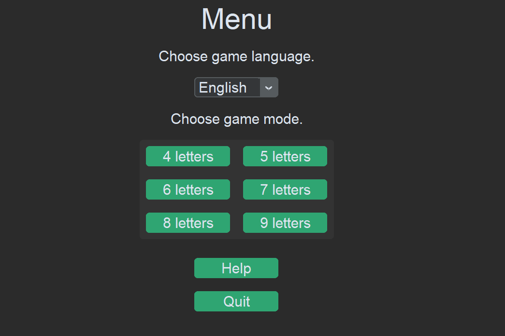

# Wordle

Wordle is a word guessing game in which you have to guess a random word in a certain number of attempts.

After game starts you type your guess and submit it by pressing ENTER.

Gray letters are not used in the word.
Yellow letters are used in the word but at different position.
Green letters are placed correctly.

## Features

- Two languages - English and Czech.
- Variant word lengths.
- You can guess by letters not words (means you can guess by any letters sequence and don't need to guess whole words)

*Note: Czech language doesn't support ď, ť, ň.*

## Functionality

Choosing random word is done by selecting a random word from a word list. Selected word is then tested if it is suitable for the game. If not new random word is chosen and tested.

Word lists were taken from https://github.com/kkrypt0nn/wordlists. Another key component of word selecting is Stanza package. With this package testing for suitable nouns is done.

GUI was made with CutomTktnter.

*Note: Some not totally suitable word could get through the testing.*

*Note: Even for czech language typing english keyboard layout is needed.*
